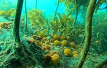
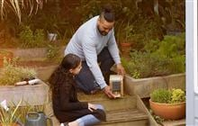
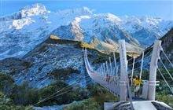

| Hero |
|---|
|  |
| Haere mai |
| [Online bookings](/parks-and-recreation/places-to-go/online-bookings/) [Walking](/parks-and-recreation/things-to-do/walking-and-tramping/) [Know before you go](/parks-and-recreation/know-before-you-go/) [Huts](/parks-and-recreation/places-to-stay/stay-in-a-hut/) [Camping](/parks-and-recreation/places-to-stay/stay-at-a-campsite/) [Hunting](/parks-and-recreation/things-to-do/hunting/) [Fishing](/parks-and-recreation/things-to-do/fishing/fishing/) [PF2050](/nature/pests-and-threats/predator-free-2050/) [Permissions](/get-involved/apply-for-permits/) [Heritage](/our-work/heritage/) [Publications](/about-us/science-publications/) [Maps](/our-work/maps-and-data/) [Royal Cam](/nature/native-animals/birds/birds-a-z/albatrosses/royal-albatross-toroa/royal-cam/) |

---

| Feature-Card |  |
| --- | --- |
|  | **Always Be Naturing**  Kiwis everywhere are helping nature bounce back – in our backyards, communities and even from our couches. Join the Always Be Naturing movement and be part of the change.  [Learn more](/always-be-naturing/) |

---

| Feature-Card |  |
| --- | --- |
|  | **Blog**  16 December 2025  **Insidious invasives pose major threat to freshwater**  Invasive freshwater species are posing a major threat to New Zealand's native fish and waterways.  [Read more](https://blog.doc.govt.nz/2025/12/16/insidious-invasives-pose-major-threat-to-freshwater/) |

---

## Featured

| Cards (2-columns) |  |  |
| --- | --- | --- |
|  | **New marine protections in the Hauraki Gulf/Tīkapa Moana** Conservation action is supporting and restoring the waters, sea life and ecosystem of the Hauraki Gulf/Tīkapa Moana. | [/our-work/revitalising-the-gulf/new-marine-protections-in-the-hauraki-gulf/](/our-work/revitalising-the-gulf/new-marine-protections-in-the-hauraki-gulf/) |
|  | **Volunteer for conservation** Get involved in volunteer activities around the country. | [/get-involved/volunteer/](/get-involved/volunteer/) |
|  | **Donate to nature** New Zealand's special wildlife and ecosystems are facing serious threats, and more action is needed to save it. | [/get-involved/donate-to-nature/](/get-involved/donate-to-nature/) |
|  | **Do your bit for nature** Discover small ways you can make a big difference for nature. | [/always-be-naturing/do-your-bit-for-nature/](/always-be-naturing/do-your-bit-for-nature/) |
| [More](/footer-links/new-on-the-site/) |

## Media releases

| Cards (2-columns) |  |  |
| --- | --- | --- |
|  | **DOC reveals first pictures of massive new Aoraki/Mount Cook swing bridge** Touted as the longest in New Zealand, the new swing bridge being built in Aoraki/Mount Cook National Park has been giving everyone a bit of a headache. | [/news/media-releases/2025-media-releases/doc-reveals-first-pictures-of-massive-new-aorakimount-cook-swing-bridge/](/news/media-releases/2025-media-releases/doc-reveals-first-pictures-of-massive-new-aorakimount-cook-swing-bridge/) |
|  | **Study to reveal the secret lives of fur seals at sea** Researchers were in Kaikōura last week to learn more about the behaviour of kekeno/New Zealand fur seals at sea. | [/news/media-releases/2025-media-releases/study-to-reveal-the-secret-lives-of-fur-seals-at-sea/](/news/media-releases/2025-media-releases/study-to-reveal-the-secret-lives-of-fur-seals-at-sea/) |
|  | **DOC welcomes resolution of judicial review of marine reserve decisions** DOC welcomes the resolution of the judicial review of decisions for six new marine reserves on the southeast South Island, confirmed by the High Court on Friday. | [/news/media-releases/2025-media-releases/doc-welcomes-resolution-of-judicial-review-of-marine-reserve-decisions/](/news/media-releases/2025-media-releases/doc-welcomes-resolution-of-judicial-review-of-marine-reserve-decisions/) |
|  | **Pukatea/Whites Bay reopening for Christmas** The popular Pukatea/Whites Bay site will reopen to the public at midday on December 22 – just in time for Christmas – after extensive storm damage repairs. | [/news/media-releases/2025-media-releases/pukateawhites-bay-reopening-for-christmas/](/news/media-releases/2025-media-releases/pukateawhites-bay-reopening-for-christmas/) |
| [More](/news/media-releases/2025-media-releases/) |

| Section Metadata |  |
| --- | --- |
| Style | two-column-layout |

---

| Metadata |  |
| --- | --- |
| Title | Haere mai |
| Description | Tō tātou taiāo. Tō tātou hītori. He tāonga tūturu nō Aotearoa. Maioha rawatia. Poipoia rawatia. Tukua. Our nature. Our history. It's New Zealand's unique legacy. Enjoy it. Enrich it. Pass it on. |
| og:image | ./images/87611e2ee1ccd22983ed1bce296e3d8c.jpg |
